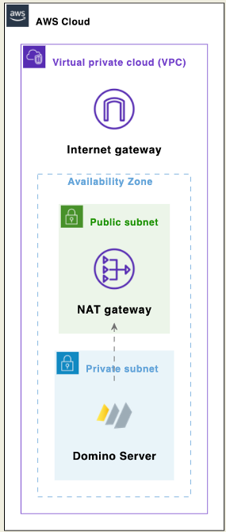
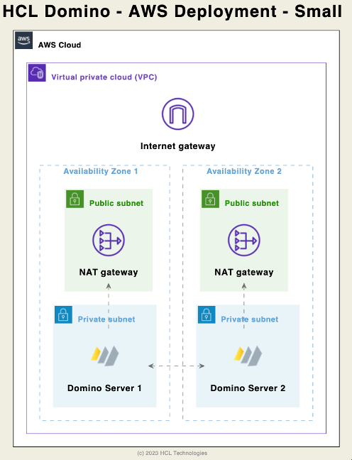

<h1>Architecture</h1>

  

    Table of contents
  

  {: .text-delta }
1. TOC
{:toc}

## Intro
HCL Domino supports containerized deployments on EKS and traditional deployments on AMI using Windows or Linux - all for test, development, staging, and production environments.

## Typical deployment overview
The typical use case for HCL Domino is providing a mail and application platform where for a small deployment all AWS based components of HCL Domino are deployed into a single AWS availability zone. 

A deployment consists of a single server (either a docker container or a virtual machine with Windows or Linux) with preferably 2 CPU cores, 8 GB RAM and 50 GB storage that can be deployed in any availability zone. 
Storage, memory, and CPU resources can be added as needed to the deployment. For more information see [sizing](sizing.md)

### HCL Domino componentes

HCL Domino Server is an all in one product where a single instance of the product is providing access to rich clients and web browser, a NAT gateway is used to provide access to TCP ports 1352, 80/443, and other ports as needed. 

### Scalability

An HCL Domino environment can scale in multiple dimensions.
* Vertially by adding more ressources to a single instance
* Horizontally by adding more servers to an environment, either in the same cluster, by adding clusters, or by adding additional Domino Domains.

## Single AZ Architecture Diagram

A typical non-HA deployment of HCL Domino would look like this:

## Multi-AZ Fault Tolerant Architecture Diagram

## Deployment