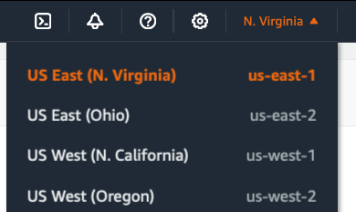
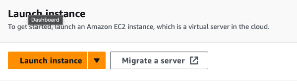
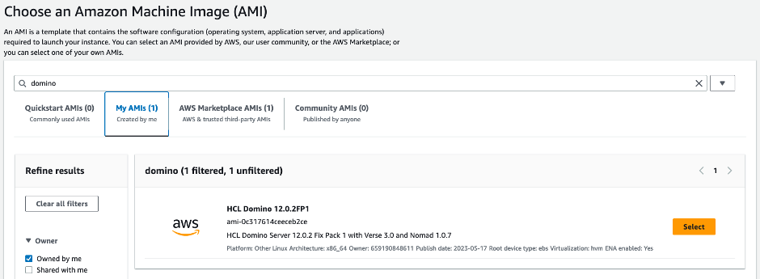
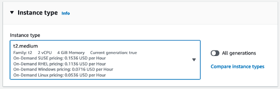

<h1>Deployment</h1>

<details close markdown="block">
  <summary>
    Table of contents
  </summary>
  {: .text-delta }
1. TOC
{:toc}
</details>


Step by step instructions to deploy an HCL Domino Server in AWS.

1. Log into [your] AWS account with the IAM entity created earlier so you have the the required permissions to deploy the an AMI. 
2. In the AWS Console, take the following steps:


## Starting an instance from an AMI 
HCL Domino is provided in form of an Amazon Machine Image (AMI), with the option to choose from different operating systems. This chapter provides the generic description for starting an AMI using Linux as an example
For a video tutorial of how to create an AWS instance from an AMI image, please refer to https://www.youtube.com/watch?v=0Gz-PUnEUF0


## Choose the AWS region in which you want to deploy 
From the top right corner, choose the AWS region the HCL Domino Server instance



## Open EC2 Service to view the dashboard
From the Services menu, open Compute and in there open EC2


## Click “Launch instance”
From within the EC2 management dashboard, launch a new instance:
 


## Define a name for your instance
e.g. “my-first-domino-server-instance” or anything else meaningful to you. 
Optionally, add additional tags as needed.


## Navigate to list of AMI’s
Click Browse more AMI’s to see shared Amazon Machine Images and Images from the Marketplace


## Choose an Amazone Machine Image (AMI)
Search for “Domino” to find the HCL Domino server machine image. Click on “Select” to continue with this image



## Choose the instance type
This AMI can be deployed to an instance type of different sizes. Please select the CPU/Memory/Storage parameters at your convenience. Please keep the HCL Domino System requriements into account.
For production deployments it is recommended to choose t2.medium instances or larger which provide 2 CPU cores and 4 Gbytes of memory.



For sizing recommendations please refer to the [HCL Domino System Requirements](https://support.hcltechsw.com/csm?id=kb_article&sysparm_article=KB0073794): 

## Key pair
Define SSH Keypair for accessing the operating system of this machine. This is your own public/private SSH key pair defined in your AWS environment. 


##	Network settings
Define or select the firewall security groups for this HCL Domino Server instance. Make sure the machine is placed in a security group which allows network traffic for all the protocols you want to use. E.g. NRPC (1352), HTTP(80), HTTPS(443), and more.


## Storage
Configure the amount of storage you want to assign to this machine. 
While HCL Domino will run with the minimum system requirements it is highly recommended to plan for growth. The specific amount of storage you will need in your deployment depends on what you are planning to do with this server. 
For test / development servers, 10Gbyte of storage should be enough.
For production deployments considder using 50 Gbyte or more 


## Launch Instance
Review all settings again and launch the instance when ready.
The machine is successfully deployed when this message is displayed.

Return to your AWS dashboard to see the running instance

# Domino Setup
Once the Amazon Machine Image has been provisioned, you need to connect to the operating system of this instance to set up HCL Domino. This chapter describes the steps to perform the initial Domino setup.

## Connect to the server instance
From the list of EC2 instances, select the Domino server instance created earlier and click the connect button.


For a video tutorial of how to connect to a Linux machine in AWS EC2 please see https://www.youtube.com/watch?v=jIxkbXB6-38 


e.g. the command should be something like:
```bash
ssh -i "your-aws-key.pem" ec2-user@your-ip.your-amazon-region.compute.amazonaws.com
```


## Domino Initial configuration
Once logged into the operating system of the EC2 instance, 
Switch to root user using the following command:
```bash
$ sudo su
```

From there, start the Domino Setup using the command
```bash
$ domino setup
```

Follow instructions in the setup to specify if this is the first server in your environment or an additional server extending an existing environment.
Please make sure to remember passwords defined in this process!

Start the Domino server
```bash
$ domino start 
```

## Testing connectivity
This chapter describes initial connectivity tests that can be performed after completing the basic Domino server setup.

### Basic Connectivitiy using HTTP
Verify if you can connect to the HCL Domino server by trying to access the Domino web login form via HTTP / TCP Port 80.
For this test, the Domino server must be running the HTTP task, which is enabled by default when following the setup instructions above.
Please note that at this point login prompt is NOT secured with an SSL/TLS certificate, so any username/password would be transferred in plain text and can be intercepted. DO NOT log in here at this point in time.
From a browser of your choice, open http://your-servers-public-ip-address , it should display the login form:


### Notes Client Access
For administrative access and to perform configuration changes in HCL Domino, it will bre required to access the HCL Domino server from a Notes client. 
To verify if TCP port 1352 is accessible from your network location, please follow instructions in [this technote](https://support.hcltechsw.com/csm?id=kb_article&sysparm_article=KB0024939)


Further information
•	[Troubleshooting: Connection problems between client and server](https://support.hcltechsw.com/csm?id=kb_article&sysparm_article=KB0100700)

### Domino Server Console Access
Console access to the HCL Domino server can be obtained in two different ways.
a) by using the HCL Domino Admin Client
b) by using SSH into the server and accessing the live console directly

Command Line access
To access the Domino server console from the command line, perform the following steps:
e.g. the command should be something like:
```bash
ssh -i "your-aws-key.pem" ec2-user@your-ip.your-amazon-region.compute.amazonaws.com
```

Switch to root user using the following command:
```bash
$ sudo su
```

From there, start the Domino Setup using the command
```bash
$ domino console
```

This will open the Domino live console, from which you can executes commands like
“show server”


A full list of commands that can be used in the live server console can be found here:
https://help.hcltechsw.com/domino/12.0.2/admin/admn_servercommandsyntax_c.html


# Next Steps & Followup
The basic server configuration is complete. However, based on the intended purpose of the server instance you need to apply further configuration.
additional configuration may include:
* Security hardening of the HCL Domino Server
* Enabling HCL Verse
* Enabling HCL Nomad
* Enabling Ontime
* Enabling Panagenda MarvelClient
* Deploying HCL Notes Client software to users
